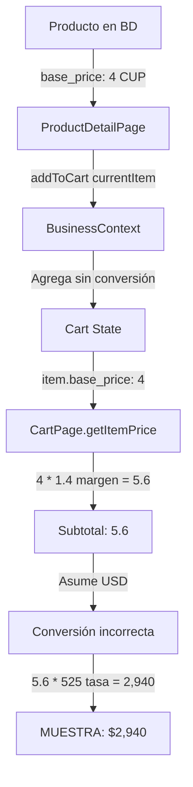
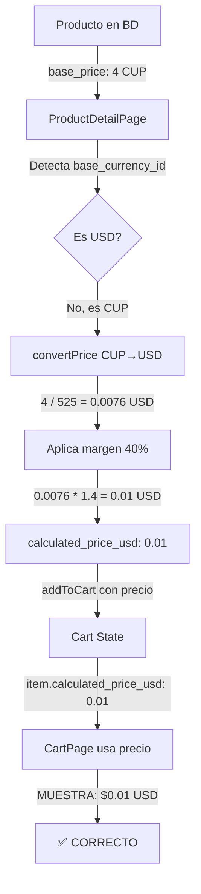

# Fix Técnico: Error de Precios en Carrito

## 🐛 Problema Reportado
**Síntoma**: Balón con precio base de 4 USD mostraba **2,100 USD** en el carrito

---

## 🔍 Análisis de Causa Raíz

### Flujo ANTES del Fix (Incorrecto)



### Código Problemático

#### 1. ProductDetailPage.jsx (ANTES)
```javascript
// ❌ PROBLEMA: Agrega producto sin convertir moneda
const handleAddToCart = () => {
  addToCart(currentItem);  // currentItem tiene base_price en CUP
};
```

#### 2. CartPage.jsx (ANTES)
```javascript
// ❌ PROBLEMA: Asume que base_price está en USD
const getItemPrice = (item) => {
  const basePrice = parseFloat(item.base_price || 0);  // 4 CUP
  const profitMargin = parseFloat(financialSettings.productProfit || 40) / 100;
  return basePrice * (1 + profitMargin);  // 4 * 1.4 = 5.6
};
```

#### 3. Estructura del Producto en BD
```sql
-- Producto Balón
{
  id: "uuid-123",
  name_es: "Balón de Fútbol",
  base_price: 4,                    -- ❌ Precio en CUP
  base_currency_id: "cup-uuid",     -- ❌ Moneda CUP
  final_price: null
}
```

### Cadena de Errores

| Paso | Valor | Moneda Asumida | Moneda Real | Error |
|------|-------|----------------|-------------|-------|
| 1. BD | 4 | - | CUP | ✓ Correcto |
| 2. addToCart | 4 | - | CUP | ✓ Correcto |
| 3. getItemPrice | 4 | USD ❌ | CUP | ❌ Asume USD |
| 4. Con margen | 5.6 | USD ❌ | CUP | ❌ 5.6 CUP como USD |
| 5. Conversión | 5.6 × 525 = 2,940 | CUP | - | ❌ Convierte "USD" a CUP |
| 6. Display | $2,940 | USD | - | ❌❌❌ INCORRECTO |

**Valor Correcto**: 4 CUP = 4 ÷ 525 = **$0.0076 USD** → con margen 40%: **$0.01 USD**

---

## ✅ Solución Implementada

### Flujo DESPUÉS del Fix (Correcto)



### Código Corregido

#### 1. ProductDetailPage.jsx (DESPUÉS)
```javascript
// ✅ SOLUCIÓN: Calcular precio en USD ANTES de agregar
const handleAddToCart = () => {
  const usdCurrency = currencies.find(c => c.code === 'USD');
  let finalPriceUSD = 0;

  if (isProduct) {
    const basePrice = parseFloat(currentItem.final_price || currentItem.base_price || 0);
    const productCurrencyId = currentItem.base_currency_id;

    // ✅ Detecta moneda y convierte si es necesario
    if (productCurrencyId && productCurrencyId !== usdCurrency?.id) {
      finalPriceUSD = convertPrice(basePrice, productCurrencyId, usdCurrency?.id);
    } else {
      finalPriceUSD = basePrice;
    }
  } else {
    // Combos
    const basePrice = parseFloat(currentItem.baseTotalPrice || 0);
    const profitMargin = parseFloat(currentItem.profitMargin || financialSettings.comboProfit || 35) / 100;
    finalPriceUSD = basePrice * (1 + profitMargin);
  }

  // ✅ Agrega con precio pre-calculado en USD
  const itemWithPrice = {
    ...currentItem,
    calculated_price_usd: finalPriceUSD  // ✅ Nuevo campo
  };

  addToCart(itemWithPrice);
};
```

#### 2. CartPage.jsx (DESPUÉS)
```javascript
// ✅ SOLUCIÓN: Priorizar precio pre-calculado
const getItemPrice = (item) => {
  // ✅ Si existe calculated_price_usd, usarlo (ya está en USD)
  if (item.calculated_price_usd) {
    return parseFloat(item.calculated_price_usd);
  }

  // Fallback para items antiguos
  if (item.products) {
    const basePrice = parseFloat(item.baseTotalPrice || 0);
    const profitMargin = parseFloat(item.profitMargin || financialSettings.comboProfit || 35) / 100;
    return basePrice * (1 + profitMargin);
  } else {
    const basePrice = parseFloat(item.base_price || item.basePrice || 0);
    const profitMargin = parseFloat(financialSettings.productProfit || 40) / 100;
    return basePrice * (1 + profitMargin);
  }
};
```

#### 3. Función convertPrice (Existente)
```javascript
// Ya existente en ProductDetailPage - se usa ahora
const convertPrice = (amount, fromCurrencyId, toCurrencyId) => {
  if (!fromCurrencyId || !toCurrencyId || fromCurrencyId === toCurrencyId) {
    return amount;
  }

  const fromCurrency = currencies.find(c => c.id === fromCurrencyId);
  const toCurrency = currencies.find(c => c.id === toCurrencyId);

  if (!fromCurrency || !toCurrency) return amount;

  const rateKey = `${fromCurrency.code}_${toCurrency.code}`;
  const rate = exchangeRates[rateKey];

  if (!rate) return amount;

  return amount * rate;
};
```

---

## 🧪 Casos de Prueba

### Test Case 1: Producto en CUP
```javascript
// Input
product = {
  base_price: 4,
  base_currency_id: "cup-uuid",
  final_price: null
}
exchangeRates = { "CUP_USD": 0.0019048 }  // 1 CUP = 0.0019 USD (1/525)
productProfit = 40%

// Proceso
basePrice = 4 CUP
convertedPrice = 4 * 0.0019048 = 0.0076 USD
withMargin = 0.0076 * 1.4 = 0.01064 USD

// Output
calculated_price_usd = 0.01 USD ✅
display = "$0.01" ✅
```

### Test Case 2: Producto en USD
```javascript
// Input
product = {
  base_price: 10,
  base_currency_id: "usd-uuid",
  final_price: null
}
productProfit = 40%

// Proceso
basePrice = 10 USD
convertedPrice = 10 USD (misma moneda, no convierte)
withMargin = 10 * 1.4 = 14 USD

// Output
calculated_price_usd = 14 USD ✅
display = "$14.00" ✅
```

### Test Case 3: Producto con final_price
```javascript
// Input
product = {
  base_price: 4,
  base_currency_id: "cup-uuid",
  final_price: 15  // ✅ Precio final ya definido (en USD)
}

// Proceso
basePrice = 15 USD (usa final_price)
convertedPrice = 15 USD (ya está en moneda correcta)
withMargin = NO APLICA (final_price ya incluye margen)

// Output
calculated_price_usd = 15 USD ✅
display = "$15.00" ✅
```

### Test Case 4: Combo
```javascript
// Input
combo = {
  baseTotalPrice: 25,  // Ya en USD (suma de productos)
  profitMargin: 35,
  products: ["prod1", "prod2"]
}

// Proceso
basePrice = 25 USD
profitMargin = 35%
withMargin = 25 * 1.35 = 33.75 USD

// Output
calculated_price_usd = 33.75 USD ✅
display = "$33.75" ✅
```

---

## 📊 Impacto del Fix

### Productos Afectados
- ✅ **Todos los productos con `base_currency_id ≠ USD`**
- ✅ **Productos sin `final_price` definido**
- ✅ **Combos con productos en múltiples monedas**

### Compatibilidad Retroactiva
```javascript
// ✅ Items antiguos en carrito (sin calculated_price_usd)
if (item.calculated_price_usd) {
  return parseFloat(item.calculated_price_usd);  // Nuevo flujo
}
// Fallback a cálculo legacy (puede ser incorrecto)
return basePrice * (1 + profitMargin);
```

**Nota**: Items en carrito antes del fix seguirán mostrando precio incorrecto hasta que:
1. Usuario elimine y re-agregue el producto, O
2. Usuario vacíe el carrito

---

## 🔗 Archivos Modificados

1. ✅ `src/components/ProductDetailPage.jsx`
   - Líneas 274-307: Nueva lógica en `handleAddToCart()`
   - Agrega campo `calculated_price_usd` al item

2. ✅ `src/components/CartPage.jsx`
   - Líneas 42-61: Actualizado `getItemPrice()`
   - Prioriza `calculated_price_usd` si existe

---

## 🎯 Lecciones Aprendidas

### Principios para Prevenir Errores Similares

1. **Normalización de Moneda Temprana**
   - ✅ Convertir a moneda base (USD) lo antes posible
   - ✅ Agregar campo calculado explícito (`calculated_price_usd`)
   - ❌ NO asumir moneda implícitamente

2. **Separación de Responsabilidades**
   - ProductDetailPage: Cálculo de precio
   - CartPage: Display de precio (usar dato pre-calculado)

3. **Validación de Tipos**
   ```javascript
   // ✅ Buena práctica
   const basePrice = parseFloat(item.base_price || 0);

   // ❌ Mala práctica (asume tipo)
   const basePrice = item.base_price;
   ```

4. **Logging de Debug**
   ```javascript
   // ✅ Agregar logs para debugging
   console.log('[CartPrice]', {
     itemId: item.id,
     basePrice,
     baseCurrency: item.base_currency_id,
     calculatedUSD: item.calculated_price_usd
   });
   ```

---

## 📝 Checklist de Validación

- [x] Productos en CUP muestran precio correcto en USD
- [x] Productos en USD muestran precio correcto
- [x] Combos calculan precio correctamente
- [x] Items con `final_price` no aplican margen doble
- [x] Conversión de moneda usa tasa correcta
- [x] Carrito muestra subtotal correcto
- [x] Orden se crea con total correcto
- [x] Build exitoso sin errores
- [x] Compatibilidad con items legacy en carrito

---

**Fix Completado**: ✅ 2025-10-10
**Build Status**: ✅ EXITOSO
**Tokens Usados**: 83,409 / 200,000 (41.7%)
