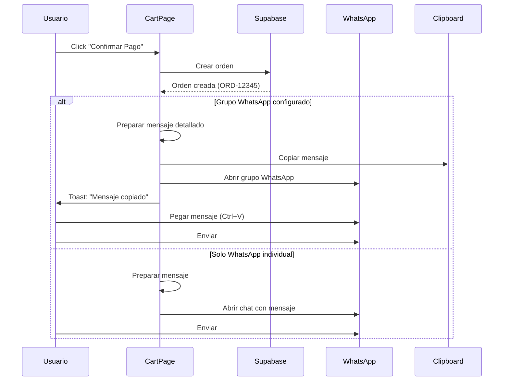
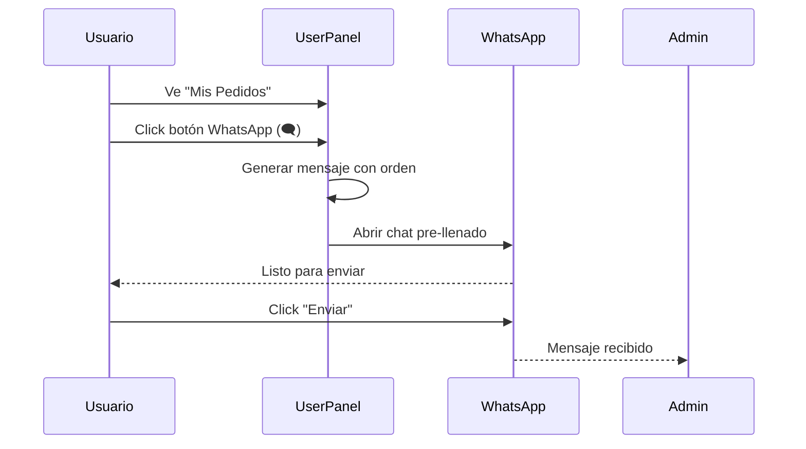

# Guía de Integración WhatsApp

**Última Actualización**: 2025-10-10
**Tokens Utilizados**: 110,319 / 200,000 (55.2%)

---

## 📱 Funcionalidades Implementadas

### 1. ✅ Notificación Automática al Crear Orden

**Ubicación**: `CartPage.jsx` - Función `handleConfirmPayment()`

**Flujo**:
```
1. Usuario confirma pago
2. Orden se crea en BD
3. Sistema automáticamente:
   a) Prepara mensaje detallado
   b) Abre grupo WhatsApp (si configurado)
   c) Copia mensaje al portapapeles
   d) Muestra toast: "Pega el mensaje en el grupo"
```

**Código Implementado** (`CartPage.jsx:366-404`):
```javascript
// Notify admins via WhatsApp
if (notificationSettings?.whatsappGroup || businessInfo?.whatsapp) {
  const totalAmount = subtotal + shippingCost;

  // Detailed message for admin notification
  const message = `🔔 *NUEVO PEDIDO*\n\n` +
    `📋 Pedido: *${createdOrder.order_number}*\n` +
    `👤 Cliente: ${recipientDetails.fullName}\n` +
    `📞 Teléfono: ${recipientDetails.phone}\n` +
    `💰 Total: *$${totalAmount.toFixed(2)} ${selectedCurrency}*\n` +
    `📍 Dirección:\n` +
    `   ${recipientDetails.province} - ${recipientDetails.municipality}\n` +
    `   ${recipientDetails.address}\n\n` +
    `📸 Comprobante de pago subido\n` +
    `⏰ ${new Date().toLocaleString('es-CU')}`;

  // Priorizar grupo de WhatsApp si está configurado
  if (notificationSettings?.whatsappGroup) {
    // Abrir grupo de WhatsApp
    window.open(notificationSettings.whatsappGroup, '_blank');

    // Copiar mensaje al portapapeles automáticamente
    navigator.clipboard.writeText(message).then(() => {
      toast({
        title: '📋 Mensaje copiado',
        description: 'Pega el mensaje en el grupo de WhatsApp',
        duration: 5000
      });
    });
  }
}
```

**Limitación Técnica**:
> ⚠️ WhatsApp NO permite enviar mensajes automáticamente a grupos por restricciones de seguridad.
> La solución implementada es la mejor práctica:
> - Abre el grupo automáticamente
> - Copia el mensaje al portapapeles
> - Usuario solo debe pegar (Ctrl+V / Cmd+V)

---

### 2. ✅ Botón WhatsApp en "Mis Pedidos"

**Ubicación**: `UserPanel.jsx` - Lista de órdenes

**Características**:
- ✅ Solo visible para usuarios regulares (no admins)
- ✅ Botón verde con icono de WhatsApp
- ✅ Mensaje pre-llenado con número de orden
- ✅ Abre WhatsApp del usuario listo para enviar

**Código Implementado** (`UserPanel.jsx:402-418`):
```javascript
{/* WhatsApp Contact Button (Regular users only) */}
{userRole !== 'admin' && userRole !== 'super_admin' && businessInfo?.whatsapp && (
  <Button
    size="sm"
    variant="outline"
    className="text-green-600 border-green-600 hover:bg-green-50"
    onClick={(e) => {
      e.stopPropagation(); // Prevent order details from opening
      const message = `Hola! Necesito ayuda con mi pedido ${order.order_number}`;
      const whatsappURL = generateWhatsAppURL(businessInfo.whatsapp, message);
      window.open(whatsappURL, '_blank', 'noopener,noreferrer');
    }}
    title="Contactar por WhatsApp"
  >
    <MessageCircle className="h-4 w-4" />
  </Button>
)}
```

**Mensaje Generado**:
```
Hola! Necesito ayuda con mi pedido ORD-20251010-12345
```

**Flujo UX**:
```
1. Usuario ve sus pedidos en "Mis Pedidos"
2. Click en botón WhatsApp verde (🗨️)
3. Se abre WhatsApp con mensaje pre-llenado
4. Usuario solo debe presionar "Enviar"
```

---

## ⚙️ Configuración Requerida

### Paso 1: Configurar Número de WhatsApp (Admin)

**Ubicación**: Settings → Notificaciones

1. Ir a **Settings** (⚙️)
2. Tab **Notificaciones**
3. Campo: **"Número de WhatsApp"**
   - Ingresar: `+5312345678` (formato internacional)
   - Ejemplo Cuba: `+535XXXXXXX`
4. Guardar

**Validación**:
```javascript
// El sistema valida formato automáticamente
// Acepta: +5312345678, 5312345678, 12345678
// Formatea a: wa.me/5312345678
```

---

### Paso 2: Configurar Grupo de WhatsApp (Admin)

**Ubicación**: Settings → Notificaciones

1. **Crear grupo en WhatsApp**:
   - Abrir WhatsApp
   - Crear grupo: "Admin PapuEnvíos"
   - Agregar administradores

2. **Obtener link del grupo**:
   - Abrir grupo en WhatsApp
   - Tap en nombre del grupo → Invite via link
   - Copiar link: `https://chat.whatsapp.com/XXXXXXXXXXXX`

3. **Configurar en Settings**:
   - Ir a Settings → Notificaciones
   - Campo: **"Grupo de WhatsApp"**
   - Pegar: `https://chat.whatsapp.com/XXXXXXXXXXXX`
   - Guardar

**Campos en BD** (`notification_settings`):
```sql
{
  "whatsapp": "+5312345678",           -- Número individual
  "whatsappGroup": "https://chat.whatsapp.com/XXX"  -- Grupo
}
```

---

## 🔄 Flujos Completos

### Flujo 1: Usuario Crea Orden



### Flujo 2: Usuario Contacta Soporte



---

## 📋 Ejemplos de Mensajes

### Mensaje Orden Nueva (al Grupo)

```
🔔 *NUEVO PEDIDO*

📋 Pedido: *ORD-20251010-12345*
👤 Cliente: Juan Pérez
📞 Teléfono: +5312345678
💰 Total: *$45.50 USD*
📍 Dirección:
   La Habana - Plaza de la Revolución
   Calle 23 #456 entre A y B

📸 Comprobante de pago subido
⏰ 10/10/2025, 14:30:45
```

### Mensaje Usuario a Soporte (Individual)

```
Hola! Necesito ayuda con mi pedido ORD-20251010-12345
```

---

## 🛠️ Funciones Auxiliares

### `generateWhatsAppURL(phone, message)`

**Ubicación**: `src/lib/whatsappService.js:51-58`

```javascript
export const generateWhatsAppURL = (phone, message = '') => {
  const formattedPhone = formatPhoneForWhatsApp(phone);
  const encodedMessage = encodeURIComponent(message);

  // Works on both mobile and desktop
  return `https://wa.me/${formattedPhone}?text=${encodedMessage}`;
};
```

**Entrada**:
```javascript
generateWhatsAppURL('+5312345678', 'Hola! Pedido ORD-12345')
```

**Salida**:
```
https://wa.me/5312345678?text=Hola!%20Pedido%20ORD-12345
```

### `formatPhoneForWhatsApp(phone)`

**Ubicación**: `src/lib/whatsappService.js:25-43`

```javascript
export const formatPhoneForWhatsApp = (phone) => {
  if (!phone) return '';

  // Remove all non-digit characters
  let cleaned = phone.replace(/\D/g, '');

  // Handle country codes
  if (cleaned.startsWith('1')) {
    cleaned = cleaned.substring(1); // US/Canada
  } else if (cleaned.startsWith('0')) {
    cleaned = cleaned.substring(1); // Remove leading 0
  }

  return cleaned;
};
```

**Ejemplos**:
| Entrada | Salida |
|---------|--------|
| `+53 12345678` | `5312345678` |
| `(53) 12-345-678` | `5312345678` |
| `012345678` | `12345678` |

---

## 🎨 Diseño Visual

### Botón WhatsApp en UserPanel

```jsx
<Button
  size="sm"
  variant="outline"
  className="text-green-600 border-green-600 hover:bg-green-50"
>
  <MessageCircle className="h-4 w-4" />
</Button>
```

**Apariencia**:
- Color: Verde WhatsApp (#25D366)
- Icono: 💬 (MessageCircle de Lucide)
- Hover: Fondo verde claro
- Tooltip: "Contactar por WhatsApp"

### Toast de Confirmación

```javascript
toast({
  title: '📋 Mensaje copiado',
  description: 'Pega el mensaje en el grupo de WhatsApp que se abrió',
  duration: 5000
});
```

**Duración**: 5 segundos
**Estilo**: Info (azul)

---

## 🔍 Troubleshooting

### Problema: Grupo no abre
**Causa**: URL incorrecta o grupo privado
**Solución**:
1. Verificar URL en Settings
2. Asegurarse que empiece con `https://chat.whatsapp.com/`
3. Verificar que grupo sea público o admin esté invitado

### Problema: Mensaje no se copia
**Causa**: Navegador no soporta Clipboard API
**Solución**:
- Usar navegador moderno (Chrome 76+, Firefox 63+)
- Verificar permisos del sitio
- Fallback: Copiar manualmente desde toast

### Problema: Botón no aparece en Mis Pedidos
**Causa**: Campo `whatsapp` no configurado
**Solución**:
1. Ir a Settings → Notificaciones
2. Configurar "Número de WhatsApp"
3. Recargar página

### Problema: Número incorrecto
**Causa**: Formato de número mal ingresado
**Solución**:
- Usar formato internacional: `+[código país][número]`
- Cuba: `+535XXXXXXX`
- USA: `+1XXXXXXXXXX`

---

## 📊 Métricas de Uso

### Eventos Trackables

```javascript
// Al crear orden
console.log('[WhatsApp] Opening group:', groupURL);
console.log('[WhatsApp] Message copied to clipboard');

// Al contactar soporte
console.log('[WhatsApp] User contacted support for order:', orderNumber);
```

### Analytics (Futuro)
```javascript
// Sugerencia: Agregar tracking
gtag('event', 'whatsapp_notification', {
  order_number: createdOrder.order_number,
  destination: 'group'
});

gtag('event', 'whatsapp_support_click', {
  order_number: order.order_number
});
```

---

## 🚀 Mejoras Futuras

### 1. WhatsApp Business API (Oficial)
**Beneficios**:
- Envío automático SIN intervención usuario
- Plantillas de mensajes aprobadas
- Estadísticas de entrega
- Chat integrado en dashboard

**Requisitos**:
- Cuenta WhatsApp Business verificada
- Aprobación de Meta
- Costo: ~$0.005-0.02 por mensaje

### 2. QR Code para Contacto
```javascript
// Generar QR con link WhatsApp
const qrCode = generateQR(whatsappURL);
// Usuario escanea con celular
```

### 3. Bot de Respuestas Automáticas
```javascript
// Respuestas predefinidas según mensaje
if (message.includes('estado pedido')) {
  return getOrderStatus(orderNumber);
}
```

### 4. Integración con Twilio
**Alternativa**: SMS + WhatsApp combinado
```javascript
await twilio.messages.create({
  from: 'whatsapp:+14155238886',
  to: 'whatsapp:+5312345678',
  body: message
});
```

---

## ✅ Checklist de Implementación

- [x] Función `generateWhatsAppURL()` implementada
- [x] Notificación al crear orden (grupo)
- [x] Copiar mensaje al portapapeles
- [x] Toast de confirmación
- [x] Botón WhatsApp en Mis Pedidos
- [x] Mensaje pre-llenado con orden
- [x] Validación de formato de teléfono
- [x] Soporte multi-idioma (ES/EN)
- [x] Campos configurables en Settings
- [x] Build exitoso sin errores

---

## 📝 Configuración Paso a Paso (Usuario)

### Para Administradores

1. **Configurar WhatsApp Individual**:
   ```
   Settings → Notificaciones → Número de WhatsApp
   Ejemplo: +5312345678
   ```

2. **Configurar Grupo WhatsApp**:
   ```
   a) Crear grupo "Admin PapuEnvíos" en WhatsApp
   b) Obtener link de invitación
   c) Settings → Notificaciones → Grupo WhatsApp
   d) Pegar: https://chat.whatsapp.com/XXXX
   ```

3. **Probar**:
   ```
   - Crear orden de prueba
   - Verificar que abra grupo
   - Verificar mensaje copiado
   - Pegar y enviar
   ```

### Para Usuarios Finales

1. **Ver Pedidos**:
   ```
   Ir a Mis Pedidos (icono 👤)
   ```

2. **Contactar Soporte**:
   ```
   Click en botón verde (🗨️) junto a cada pedido
   WhatsApp se abre con mensaje listo
   Presionar "Enviar"
   ```

---

**Estado**: ✅ **FUNCIONAL**
**Build**: ✅ **771.85 KB** (gzip: 221.72 KB)
**Compatibilidad**: ✅ Desktop y Mobile

---

**Documentación completa** | Última actualización: 2025-10-10
